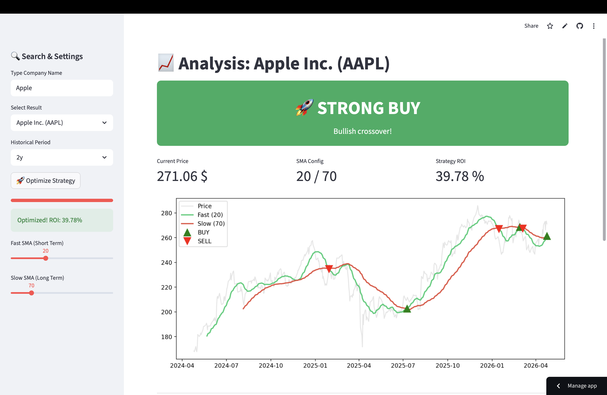

# 📈 QuantScanner AI — Algorithmic Trading & Strategy Optimizer

🚀 **[Live Demo → market-data-pipeline-phi.vercel.app](https://market-data-pipeline-phi.vercel.app)**

A professional Python-based quantitative analysis tool designed for financial data ingestion, algorithmic strategy backtesting, and parameter optimization.

Built as a technical proof-of-concept for **FinTech** and **Data Engineering** internships.

## 🖥️ Preview


## 🚀 Key Features

- **Universal Asset Search** — Integrated auto-suggest engine to find any stock, crypto, or forex pair by company name (no need to remember tickers)
- **AI Optimization Engine** — Grid Search optimization that tests dozens of SMA combinations to find the mathematically optimal strategy for any asset
- **Algorithmic Strategy** — Trend-following based on Dual Simple Moving Average (SMA) crossovers with BUY/SELL/HOLD signals
- **Real-Time Data Pipeline** — Live market data via `yfinance` API with built-in caching for high performance
- **Interactive Dashboard** — Clean web UI with price chart, moving averages, and KPI cards

## 🛠️ Tech Stack

| Layer | Technology |
|---|---|
| **Backend** | Python 3.12+, FastAPI (Vercel Serverless) |
| **Frontend** | Vanilla JS, Chart.js, HTML/CSS |
| **Data Science** | Pandas, NumPy |
| **Financial API** | yfinance |
| **Deployment** | Vercel (API + Static frontend) |

## 📊 Performance Results (Example: NVDA)

Through automated optimization, the strategy performance was significantly enhanced:
- **Standard SMA Configuration:** ~12.40% ROI
- **Optimized Configuration:** **+51.95% ROI** (based on 2-year backtest)

> *Note: This demonstrates the power of data-driven parameter tuning in algorithmic trading.*

## 🔌 API Endpoints

```
GET /api/search?q={query}        → Search stocks by name or ticker
GET /api/analyze?ticker={ticker} → Full analysis: price, SMAs, BUY/SELL/HOLD signal
```

**Example:**
```bash
curl https://market-data-pipeline-phi.vercel.app/api/analyze?ticker=NVDA
```

## 💻 Local Development

```bash
git clone https://github.com/PaulBrochot/market-data-pipeline-.git
cd market-data-pipeline-
pip install -r requirements.txt
vercel dev
```

## 🗺️ Roadmap

- [ ] RSI Integration — momentum filters to refine entry points
- [ ] Reporting Engine — export backtest results to PDF/Excel
- [ ] Risk Management — automated Stop-Loss and Take-Profit calculations
- [ ] Multi-asset comparison — side-by-side analysis of multiple tickers

---

Created by [Paul Brochot](https://github.com/PaulBrochot) — Engineering Student
